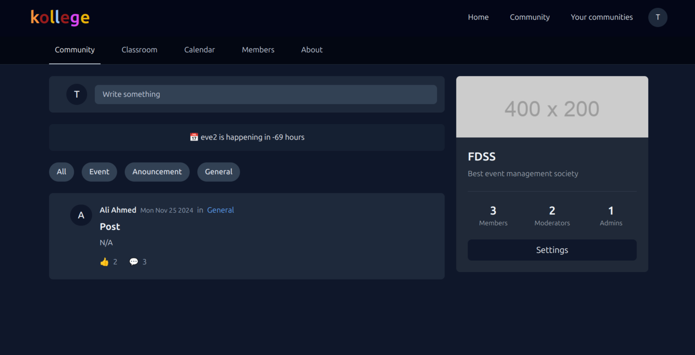

# Kollege (community learning management system for tutors and learners)

Ever tired of joining different platforms such as discord, reddit or facebook groups to resolve queries after enrolling in an online course as a learner or having trouble setting up a platform to create an engaging and active community as a tutor?

Kollege is a newly developed, standalone platform
designed to address the limitations of existing Learning Management Systems (LMS). Unlike platforms such as Udemy or Coursera, which focus primarily on course delivery, kollege integrates community-building features to provide a holistic learning environment. This unique combination eliminates the need for external tools like Discord or Reddit for community interaction, offering a
unified space for learning and collaboration.

## Features 

- 📝 Community Management  
- ✍️ Create/Delete Posts  
- 📽️ Manage Courses  
- 🎫 Events Scheduler  
- 🚪 Remove Members  
- 🎯 Manage Privileges  
- ✉️ Approve Join Requests  
- 💭 Comments & Replies  
- 👥 User Profiles 
- 🤝 Live Chat 
- 🔒 Secure Authentication 
- 📱 Mobile-Friendly Design 

Packed with countless extras!

## Overview

## Tech Stack

**Client:** React, Zustand, TailwindCSS

**Server:** Node, Express

**Database:** MySQL, MySQL2 client

**Others:** Socket.io, jsonwebtoken 
## Roadmap

&#9744; Livestream functionality using WebRTC SFU server 

&#9744; Setup a cloud storage to store video uploads

&#9744; Notification system using server sent events

&#9744; Mobile responsiveness

## Contributing

Contributions are always welcome!

Please adhere to this project's `code of conduct`.

